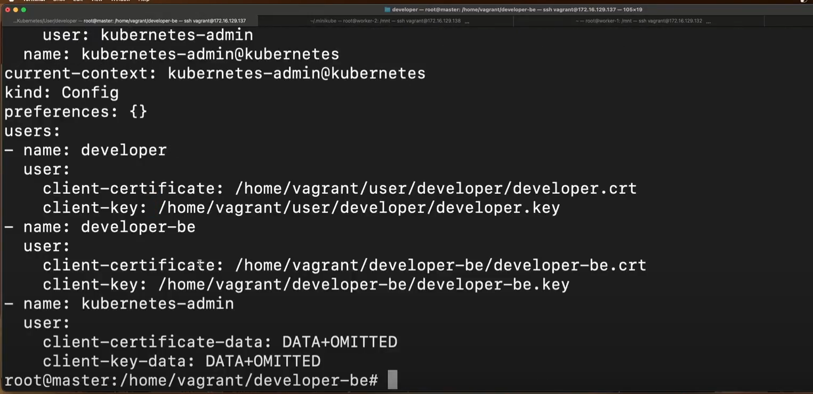
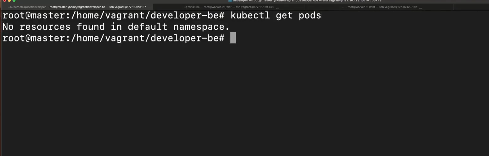
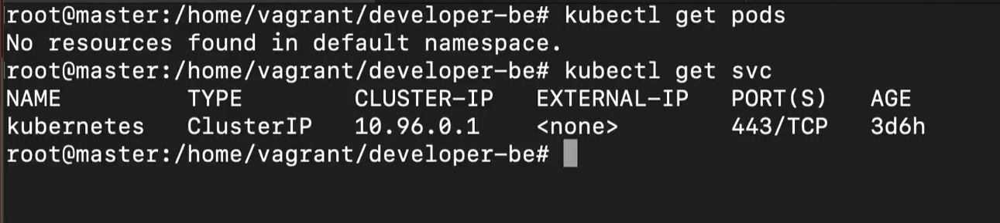
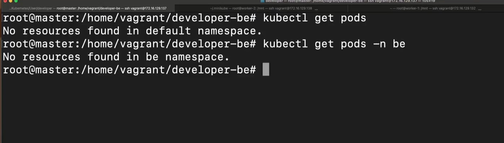

# 1. Role-based access control (RBAC) là gì ?

- Role-based access control (RBAC) trong Kubernetes là một cơ chế để quản lý và kiểm soát quyền truy cập trong một Kubernetes Cluster. Nó cho phép quản trị viên định nghĩa các Rule và gán chúng cho User hoặc Group dùng để xác định quyền truy cập vào các tài nguyên trong Cluster.
- Trong Kubernetes, RBAC được triển khai thông qua các thành phần chính: Role, ClusterRole và RoleBindings ClusterRoleBinding. Role và ClusterRole định nghĩa các quyền truy cập cụ thể cho một tài nguyên như Pods, Services, Deployments và Namespaces. RoleBinding và ClusterRoleBindings được sử dụng để gán Role đã được định nghĩa, RoleBinding sẽ gán cho User còn ClusterRoleBinding gán cho Group.

# 2. Mục đích sử dụng Role-based access control (RBAC)

- Với RBAC trong Kubernetes, quản trị viên có thể kiểm soát quyền truy cập của người dùng vào các tài nguyên khác nhau. Điều này giúp đảm bảo rằng mỗi người dùng chỉ có quyền truy cập vào các tài nguyên mà họ cần để thực hiện công việc của mình, đồng thời ngăn chặn truy cập trái phép hoặc không cần thiết đến các tài nguyên quan trọng.

- RBAC trong Kubernetes cung cấp một cơ chế linh hoạt và mạnh mẽ để quản lý quyền truy cập, giúp tăng cường bảo mật và kiểm soát trong môi trường Kubernetes.

## Ngoài RBAC, Kubernetes còn hỗ trợ một số loại khác để quản lý quyền truy cập:

- Attribute-based access control (ABAC): là một phương pháp quản lý quyền truy cập dựa trên các thuộc tính của đối tượng và ngữ cảnh. Trong Kubernetes, ABAC cho phép định nghĩa các quy tắc dựa trên các thuộc tính của người dùng, nhóm người dùng, tài nguyên và hành động để xác định quyền truy cập.
- Webhook mode: cho phép tích hợp với các hệ thống quản lý quyền truy cập bên ngoài như OAuth, OpenID Connect. Khi được kích hoạt, Kubernetes sẽ gọi đến một webhook để kiểm tra và quyết định quyền truy cập dựa trên phản hồi từ webhook.

- Node authorizer: là một plugin trong Kubernetes API Server, cho phép kiểm tra quyền truy cập dựa trên địa chỉ IP của Node trong cụm. Khi một yêu cầu truy cập tới từ một Node, Node authorizer sẽ xác minh xem địa chỉ IP của Node đó có quyền truy cập vào tài nguyên được yêu cầu hay không.

# 3. Cách thành phần để setup Role-based access control (RBAC)

Để thiết lập Role-based access control (RBAC) trong Kubernetes, có các thành phần sau:

- Role: là thành phần chính để định nghĩa các quyền truy cập cụ thể cho tài nguyên rong Kubernetes. Một Role định nghĩa tập hợp các quyền truy cập, được gắn liền với một namespace cụ thể.
- # ClusterRole: tương tự như Role, nhưng áp dụng trên toàn Cluster thay vì một namespace. Chúng được sử dụng để định nghĩa các quyền truy cập cho các tài nguyên không thuộc về namespace cụ thể.
- RoleBinding: được sử dụng để liên kết Role với một đối tượng cụ thể và xác định quyền truy cập
- ClusterRoleBinding: tương tự như RoleBinding, nhưng áp dụng cho ClusterRole thay vì Roles. Chúng liên kết các ClusterRole với đối tượng cụ thể trong toàn bộ Cluster.

# Trong Kubernetes RBAC (Role-Based Access Control), có 3 loại đối tượng cần xác thực:

- Người dùng (User): Đây là các tài khoản người dùng được tạo ra và quản lý bởi hệ thống xác thực của Kubernetes hoặc cơ sở dữ liệu xác thực ngoài. Có thể là người dùng hệ thống hoặc người dùng được tạo ra bởi người quản trị hệ thống.
- Nhóm (Group): Đây là tập hợp các người dùng được nhóm lại với nhau để chia sẻ các quyền truy cập với Role tương tự. Các nhóm có thể được tạo ra trong hệ thống xác thực của Kubernetes hoặc từ cơ sở dữ liệu xác thực ngoài.
- Service Account: Đây là các tài khoản được tạo ra tự động và quản lý bởi Kubernetes. Chúng được sử dụng bởi các ứng dụng và các thành phần trong môi trường Kubernetes để xác thực và truy cập vào các tài nguyên.


Tập trung vào việc triển khai và quản lý Kubernetes trên EKS. Cài đặt công cụ kubectl và eksctl trên máy local, sau đó sử dụng eksctl để tạo một EKS cluster và kết nối đến nó. Cấu hình và sử dụng Application Load Balancer (ALB) làm LoadBalancer cho các dịch vụ trong EKS, tạo cấu hình Ingress với đường dẫn /api cho backend và / cho frontend, sau đó kiểm tra truy cập thông qua ALB. Tiếp theo cấu hình Persistent Volume và Persistent Volume Claim (PVC) sử dụng Amazon EBS làm lớp lưu trữ, triển khai chúng cho dịch vụ MongoDB, và kiểm tra tính kiên trì của dữ liệu khi pod MongoDB bị dừng. Cuối cùng tạo một người dùng IAM mới, cấp quyền Admin, và cấu hình Role-based Access Control (RBAC) trong EKS để liên kết người dùng này với một role cụ thể, sau đó kiểm tra khả năng truy cập của người dùng IAM này vào EKS cluster.

Cấu hình OpenID Connect (OIDC) cho phép các dịch vụ trong EKS cluster sử dụng IAM Role linh hoạt và an toàn hơn, hỗ trợ quản lý quyền truy cập theo vai trò cho các tài khoản dịch vụ, tăng cường bảo mật khi triển khai ứng dụng. Sau đó, cài đặt kubectl và eksctl trên máy local, sử dụng eksctl để tạo một EKS cluster và kết nối đến nó. Cấu hình Application Load Balancer (ALB) làm LoadBalancer cho các dịch vụ trong EKS, thiết lập Ingress với đường dẫn /api cho backend và / cho frontend, rồi kiểm tra quyền truy cập qua ALB. Tiếp tục cấu hình Persistent Volume và Persistent Volume Claim (PVC) với Amazon EBS làm lớp lưu trữ cho dịch vụ MongoDB, đảm bảo tính bền vững dữ liệu khi pod MongoDB bị dừng. Cuối cùng tạo một người dùng IAM mới, cấp quyền Admin, và cấu hình Role-based Access Control (RBAC) trong EKS để liên kết người dùng này với một role cụ thể, sau đó kiểm tra khả năng truy cập của người dùng IAM này vào EKS cluster.


===================================================
# Thực hành RBAC

# Service account

- 1 pod lằm trong k8s, và pod đó muốn truy suất các thông tin trong k8s, như monitoring. Ví dụ: 1 pod prometheus thường là pod đi collect data từ một service nào đó như lấy mectric về cpu, ram, disk của 1 pod bên trong k8s

# Service account: những pod muốn truy cập vào những tài nguyên bên trong k8s thì cần sử dụng 1 service account ở trong k8s

```bash
k apply -f pod-nginx.yaml

watch kubectl get pods
```


```bash
k get sa
```

Nếu pod không chỉ định service account thì mặc định là default => việc set accout service giúp pod có thể lấy những thông tin gì đó tùy theo phần quyền bên trong service account default


```bash
k get pods/pod-nginx -o yaml
```


Mỗi service account thường có 1 certificate đi theo account đó

```bash
k get secret 
```


```bash
k get sa/default -o yaml

## exec vo pod
k exec -it pod/pod-nginx bash
cd /var/run/secrets/kubernetes.io/serviceaccount/
```

Sẽ thấy ca.crt và token


```bash
cat namespace
```
namespace là default

cat ca.crt

cat token


==> Pod sẽ sử dụng những thông tin này để truy cập thông tin k8s bên ngoài

- Để call được thông tin k8s => call api server k8s, api server là một trong proccess lằm trong control plane dùng để nhận các request từ bên ngoài và khi khi nhận được request bước đầu tiên là nó authen cái request đó xem đến từ đâu và ai là người request, sau đó là sẽ check quyền của người request  này 

- APi Group: k8s quản lý resource ví dụ: pod, ...


Chú ý: exit khỏi pod
```bash
exit
k cluster-info
```

Ta sử dụng kubernets control plane api


Để call được api server bên trong pod, ta có thể sử dụng DNS của service

```bash
k get svc -A
```

Sử dụng tên service để call appi


```bash
k exec -it pod/nginx bash

# name-service.namespace.svc
curl https://kubernetes.default.svc
```
Báo lỗi SSL CRT problem


Để gọi được ta cần phải tìm được những thông tin: Certificate (call api server cần phải xác thực, xác thực ở đây cần crt rồi token mới authen được), token

```bash
export SERVICEACCOUNT=/var/run/secrets/kubernetes.io/serviceaccount
export TOKEN=$(cat ${SERVICEACCOUNT}/token)
export CACERT=${SERVICEACCOUNT}/ca.crt
```

```bash
export
```


```bash
## /api/v1 gọi đến những thành phần core của k8s
curl --cacert ${CACERT} --header "Authorization: Bearer ${TOKEN}" -X GET https://kubernetes.default.svc/api/v1/namespaces/default/pods
```
Được Authen nhưng chưa có quyền list resource


Trường hợp token bị sai => Authzation (không xác thực được)

```bash
curl --cacert ${CACERT} --header "Authorization: Bearer aaaa" -X GET https://kubernetes.default.svc/api/v1/namespaces/default/pods
```


==> Để call được cần set quyền cho tài khoản đó

Exit khỏi pod đó
```bash
exit

vi role-default.yaml
```

Tạo role

Role  nó sẽ binding với 1 service account với 1 namespace nào đó ví dụ: default


Role ở đây chỉ là 1 quyền, còn quyền được gắn cho ai thì cần RoleBinding và Service account dùng cho các pod chạy k8s


```yaml
#1. Tạo ServiceAccount
#Tạo một ServiceAccount trong namespace mặc định (hoặc namespace mà bạn cần).
---
apiVersion: v1
kind: ServiceAccount
metadata:
  name: viettu
  namespace: default
---
# 2. Tạo Role
# Role này sẽ có quyền đọc (get, list, watch), sửa (update, patch), và xóa (delete) trên Pod, Service, và Deployment.
apiVersion: rbac.authorization.k8s.io/v1
kind: Role
metadata:
  name: custom-role
  namespace: default
rules:
  - apiGroups: [""] ## Empty Core API Group (["*"] truy cập tất cả group)
    resources: ["pods", "services"]
    verbs: ["get", "list", "watch", "create", "update", "patch", "delete"]
  - apiGroups: ["apps"]
    resources: ["deployments"]
    verbs: ["get", "list", "watch", "create", "update", "patch", "delete"]
---
#3. Tạo RoleBinding
#RoleBinding này sẽ liên kết Role với ServiceAccount.

apiVersion: rbac.authorization.k8s.io/v1
kind: RoleBinding
metadata:
  name: custom-rolebinding
  namespace: default
subjects: ## object assign
  - kind: ServiceAccount ## dùng cho pod chạy trong k8s
    name: viettu
    namespace: default
roleRef:
  kind: Role
  name: custom-role
  apiGroup: rbac.authorization.k8s.io
---
# Bước 4: Gắn ServiceAccount vào Pod
# Cuối cùng, bạn có thể gắn ServiceAccount vào một Pod hoặc Deployment bằng cách chỉ định trường serviceAccountName.
# pod.yaml
apiVersion: v1
kind: Pod
metadata:
  name: my-pod
  namespace: default
spec:
  serviceAccountName: viettu
  containers:
    - name: my-container
      image: nginx
      resources:
        limits:
          memory: "128Mi"
          cpu: "100m"
---
#Ví dụ với Deployment
# deployment.yaml
apiVersion: apps/v1
kind: Deployment
metadata:
  name: my-deployment
  namespace: default
spec:
  replicas: 2
  selector:
    matchLabels:
      app: my-app
  template:
    metadata:
      labels:
        app: my-app
    spec:
      serviceAccountName: viettu
      containers:
        - name: my-container
          image: nginx
          resources:
            limits:
              memory: "128Mi"
              cpu: "100m"
# kubectl apply -f serviceaccount.yaml
# kubectl apply -f role.yaml
# kubectl apply -f rolebinding.yaml
# kubectl apply -f pod.yaml
# # hoặc cho Deployment
# kubectl apply -f deployment.yaml

```

```bash
k get role
k get rolebinding
```


```bash
k exec -it pod/pod-nginx bash

# lấy các pod đang chạy trên namespace default
curl --cacert ${CACERT} --header "Authorization: Bearer ${TOKEN}" -X GET https://kubernetes.default.svc/api/v1/namespaces/default/pods

# Get service
curl --cacert ${CACERT} --header "Authorization: Bearer ${TOKEN}" -X GET https://kubernetes.default.svc/api/v1/namespaces/default/services
# Get deployment
curl --cacert ${CACERT} --header "Authorization: Bearer ${TOKEN}" -X GET https://kubernetes.default.svc/api/app/namespaces/default/deployment
```

Kins: PodList, items: [name: "pod-nginx"] ==>  Ví dụ chỉ cần tạo 1 pod xét cho nó role để collect thông tin các pod đạng chạy trển ns default => Tạo trang frontend từ thông tin API trả về => View các pod đang chạy (Build trang tự monitor các pod đang chạy)


```bash
curl --cacert ${CACERT} --header "Authorization: Bearer ${TOKEN}" -X GET https://kubernetes.default.svc/api/v1/kube-system/pods
```

Sẽ không có quyền để gọi tới những namespace này


Sủa lại role xóa services ra khỏi resources

```bash
vi role-default.yaml
```


```bash
# Get service
curl --cacert ${CACERT} --header "Authorization: Bearer ${TOKEN}" -X GET https://kubernetes.default.svc/api/v1/namespaces/default/services
# Get deployment
```

Kết quả bị lỗi Forbidden (vì role không có quyền trên service)


==> Đó là phần quyền trong Service account 

==> `Khi set service account cho pod thì pod sẽ tự động được gán ca.crt và token` tương ứng với service account đó

# User
- Ví dụ là 1 quản trị viên k8s, ta sẽ set quyền cho developer đó có quyền truy cập vào trong resouce k8s


```
- Lệnh kubectl config view  được sử dụng để hiển thị cấu hình của kubectl. Cấu hình này bao gồm thông tin về các cluster, người dùng (users), và các context mà kubectl đang quản lý.

- Cụ thể, lệnh này hiển thị các thành phần trong file cấu hình kubeconfig (thường nằm ở ~/.kube/config), bao gồm:

    1. Clusters: Danh sách các cluster mà bạn có thể kết nối.
    2. Users: Danh sách các thông tin xác thực của người dùng (credentials).
    3. Contexts: Các context (bối cảnh) giúp xác định cluster, người dùng và namespace mặc định mà kubectl sẽ sử dụng.
    4. Current context: Hiển thị context hiện tại mà kubectl đang sử dụng, tức là cluster và người dùng nào đang được chọn.
```

```bash
 k config view
```

===> Bản chất cmd kubectl là một cmd khi chạy các câu lệnh get pods, get svc, để nó có thể chạy được thì nó cần các config như trên, config này để nó biết gọi đến các cluster k8s nào, rồi sử dụng user nào để gọi tới, rồi certificate, key ở đâu để nó có thể xác thực  (thực chất khi sử dụng lện kubectl là đang call các api đến control plane)

Cluster: certificate-authority-data (đã được dấu đi rồi)
Server: Bạn muốn call api đến server cluster nào
name: tên của cluster đó


User: ta sẽ tạo ra nhiều user khác nhau, ví dụ: user developer ở môi trường dev (namespace dev), một user ở môi trường product
client-certificate và client-key: để ta authen user này (Có thể truyền trực tiếp hoặc đường dẫn file, thêm -data để truyền trực tiếp)

Khi cài đặt k8s thì được set mặc định user: kubernetes-admin, để sử dụng như một người quản trị


Context ở đây như là một roleBinding, nó define một cái name context, cluster và user => Ví dụ tôi muốn sử dụng user developer ở cluster kubernetes => thì ta sẽ set một cái context ==> Khi sử dụng kubectl thì nó sẽ sử dụng User `developer` tới cluster là kubernetes và tường ứng server cluster là: https//192.168.129.1137:6443

Current-context: Nếu ta muốn sử dụng context (hay cluster nào) có thể define ở đây là tên của context ví dụ: name context: kubernetes-admin, user: kubernetes-admin gọi đến cluster kubernetes với IP server:  https//192.168.129.1137:6443


# Triển khai phân quyền cho User

===> Tạo thêm user và phân quyền cho user truy cập vào một số resource ta mong muốn

Trước tiên ta cần tạo một Certificate và một cái key để Authen cho User
=> Key xác thực certificate
```bash
mkdir developer
cd developer


## Tạo key (generate sa) 
openssl genrsa -out developer-be.key 2048

# Tạo CSR (Certificate Signing Request) sử dụng private key 
# Cung cấp thông tin định danh (subject) cho chủ thể của chứng chỉ.
## k8s sẽ hiểu những thông tin bên trong CSR để xem bạn là ai
## CN: ở đây khi mà gửi req này đi và kubernetes api server sẽ nhận cái này là xác thực User, tướng ứng với User: developer-be trong config view
## O Ở đây là group nào tức namepsace nào 
openssl req -new -key developer-be.key -out developer-be.csr -subj "/CN=developer-be/O=staging"

```


```
Trong lệnh openssl req mà bạn đã đưa ra, tham số -subj được sử dụng để chỉ định Subject Distinguished Name (DN) của chứng chỉ, tức là cung cấp thông tin định danh cho chủ thể của chứng chỉ.

Cụ thể:
    - -subj "/CN=developer-be/O=staging" là cách bạn truyền các thông tin định danh cho chứng chỉ trong lệnh này.
        - CN (Common Name): Đây là tên phổ biến (Common Name) của chứng chỉ. Trong ví dụ của bạn, CN=developer-be chỉ định rằng chủ thể của chứng chỉ này là developer-be.
        - O (Organization): Tổ chức mà chủ thể thuộc về. Trong ví dụ của bạn, O=staging chỉ định rằng chủ thể thuộc về tổ chức staging.
```


Bây giờ sẽ cần phải ký CSR để tạo ra một CSR (đã được ký)

```bash
# CA là mình cần đi tìm một Certificate của người quản trị Kubernetes này (CSR Root), sử dụng CSR Root của user admin k8s để ký cho những account khác
# CAKey: key  của account quản trị viên, người tạo lên kubernetes
# CRT là viết tắt của Certificate
openssl x509 -req -in developer-be.csr -CA /etc/kubernetes/pki/ca.crt -CAkey /etc/kubernetes/pki/ca.key -CAcreateserial -out developer-be.crt -days 365


```
```
Giải thích từng thành phần:
1. openssl x509 -req:

    - x509: Đây là lệnh của OpenSSL để quản lý và xử lý chứng chỉ theo định dạng x.509, một chuẩn cho chứng chỉ SSL/TLS.
    - -req: Cho biết rằng bạn đang sử dụng một CSR (Certificate Signing Request) làm đầu vào và muốn ký nó để tạo chứng chỉ.
2. -in developer-be.csr:

    - Xác định file CSR (developer-be.csr) là đầu vào, tức là yêu cầu ký chứng chỉ này. CSR chứa các thông tin như CN, O, và các khóa public.
3. -CA /etc/kubernetes/pki/ca.crt:

    - Đường dẫn đến chứng chỉ của Certificate Authority (CA), được sử dụng để ký CSR này. Chứng chỉ này sẽ là CA xác nhận danh tính của chủ thể chứng chỉ.
4. -CAkey /etc/kubernetes/pki/ca.key:

    - Đường dẫn đến private key của CA, được sử dụng để ký CSR. Chứng chỉ của CA là public, nhưng cần private key của CA để ký chứng chỉ một cách hợp lệ.
5. -CAcreateserial:

    - Tùy chọn này tạo một file số sê-ri (.srl) nếu chưa tồn tại. Mỗi khi CA ký một chứng chỉ mới, nó sẽ sử dụng số sê-ri duy nhất, và file số sê-ri này sẽ theo dõi giá trị tiếp theo.
6. -out developer-be.crt:

    - Đây là file đầu ra, tức là chứng chỉ cuối cùng (developer-be.crt) sẽ được tạo sau khi ký CSR. Đây là chứng chỉ đã được CA ký.
7. -days 365:

    - Tùy chọn này chỉ định thời hạn của chứng chỉ. Trong trường hợp này, chứng chỉ sẽ có giá trị trong 365 ngày (1 năm) từ ngày phát hành.
## Quá trình tổng quan:
- Bạn đang lấy CSR (developer-be.csr) và ký nó bằng chứng chỉ CA (ca.crt) và khóa riêng của CA (ca.key).
- Chứng chỉ mới được tạo ra (developer-be.crt) sẽ được sử dụng để xác thực developer-be, và nó sẽ có hiệu lực trong 365 ngày.
#3 Chức năng:
Ký chứng chỉ client: Lệnh này thường được sử dụng trong các hệ thống có xác thực lẫn nhau, nơi client cần chứng chỉ đã ký bởi CA để xác thực an toàn với server
```

Kết quả ký thành công => sử dụng 2 file: developer-be.crt và developer-be.key để Authen


Có 2 cách để xét config
```bash
# get command config
k config --help
# View config
k config view

# xét user 
k config set-credentials developer-be --client-certificate=developer-be.crt --client-key=developer-be.key
```

Kết quả: 

```bash
# Kiểm tra config view với user vừa được set
k config view
```

Sẽ thấy một user mới: developer-be, và tự động được trỏ tới file chứa Certificate và key


```bash
## Tạo context 
## cluster: mình muốn call đến cluster nào
kubectl config set-context developer-be-context --cluster=kubernetes --user=developer-be
```

Kết quả

Kết quả: sẽ tạo ra một context với name: developer-be-context


===> Bây giờ sẽ đổi current-context này sang developer-be-context

```bash
k config use-context developer-be-context
```


```bash
# Get pod để kiểm tra xem có quyền không
k get pods
# Error from server (Forbidden): pods is forbidden: User "developer-be" cannot list resource "pods" in API group "" in the namespace "default"
```

==> User: developer-be không có quyền get pod => Forbidden: pods is forbidden


```bash
# Xet lại user admin
k config use-context kubernetes-admin@kubernetes
```

==> Xét quyền cho User: developer-be

```bash
vi role.yaml
```


```bash
vi role-binding.yaml
```


```yaml
apiVersion: rbac.authorization.k8s.io/v1
kind: Role
metadata:
  name: developer-role
  namespace: default
rules:
  - apiGroups: [""]
    resources: ["pods", "services"]
    verbs: ["get", "list", "watch", "create", "update", "patch", "delete"]
  - apiGroups: ["apps"]
    resources: ["deployments"]
    verbs: ["get", "list", "watch", "create", "update", "patch", "delete"]
---
apiVersion: rbac.authorization.k8s.io/v1
kind: RoleBinding
metadata:
  name: developer-rolebinding
  namespace: default
subjects:
  - kind: User
    name: developer-be
    namespace: default
roleRef:
  kind: Role
  name: developer-role
  apiGroup: rbac.authorization.k8s.io

```

```bash
k config use-context developer-be-context
```


Chú ý: chỉ có quyền trên namespace: default
```bash
k get pods
k get svc
```

Có thể get pods và services




Set lại context admin và xóa resouce pods đi và get pods lại xem được không

```bash
k config use-context kubernetes-admin@kubernetes
```


```yaml
apiVersion: rbac.authorization.k8s.io/v1
kind: Role
metadata:
  name: developer-role
  namespace: default
rules:
  - apiGroups: [""]
    resources: ["services"]
    verbs: ["get", "list", "watch", "create", "update", "patch", "delete"]
  - apiGroups: ["apps"]
    resources: ["deployments"]
    verbs: ["get", "list", "watch", "create", "update", "patch", "delete"]
```

```bash
k config use-context developer-be-context
```

```bash
k get pods
```

Sẽ bị lỗi forbidden khi get pods

Với services thì get được


Quay về context của admin và sửa rolebinding

```bash
k config use-context kubernetes-admin@kubernetes
```

```bash
vi role-binding.yaml
```

Thay đổi một user không tồn tại


```yaml
apiVersion: rbac.authorization.k8s.io/v1
kind: RoleBinding
metadata:
  name: developer-rolebinding
  namespace: default
subjects:
  - kind: User
    name: ABCDx
    namespace: default
roleRef:
  kind: Role
  name: developer-role
  apiGroup: rbac.authorization.k8s.io
```

```bash
k config use-context developer-be-context
```

```bash
k get pods
```

Báo lỗi chỉ user "developer-be" mới có quyền list pods, chỉ nhận với user subject là "developer-be" (Do ta cấu hình ở phần opensl có subject là "developer-be")


Quay về context của admin và sửa namespace thành một namespace không tồn tại ở role-binding và role

```bash
k config use-context kubernetes-admin@kubernetes
```


```yaml
apiVersion: rbac.authorization.k8s.io/v1
kind: Role
metadata:
  name: developer-role
  namespace: be
rules:
  - apiGroups: [""]
    resources: ["services"]
    verbs: ["get", "list", "watch", "create", "update", "patch", "delete"]
  - apiGroups: ["apps"]
    resources: ["deployments"]
    verbs: ["get", "list", "watch", "create", "update", "patch", "delete"]
---
apiVersion: rbac.authorization.k8s.io/v1
kind: RoleBinding
metadata:
  name: developer-rolebinding
  namespace: be
subjects:
  - kind: User
    name: developer-be
    namespace: be
roleRef:
  kind: Role
  name: developer-role
  apiGroup: rbac.authorization.k8s.io
```

Kết quả: không có quyền get pods trên namespace default


# Cluster Role
- Cluster role không phân biệt namespace, nghĩa là user có được toàn quyền, truy cập vào một cluster bất kỳ với namespace nào thì nó cũng truy cập được hết chỉ quan tâm đến resource thôi (ví dụ: pod, service)
- `Ngoài ra còn phân chia theo group được, group ở đây khi mọi người muốn assign cùng một permision cho nhiều User khách nhau` nếu không có cluster role thì phải đi xét tạo nhữn rolebilding xét cho từng user => Mất thời gian, có thể sử dụng cluster role binding có thể assign vào một group ==> `Group` ở đây khi vừa này tạo CSR , ở phần Subject có tạo một Group là `Staging` => nghĩa là `developer-be` thuộc group `staging`
 
```bash
openssl req -new -key developer-be.key -out developer-be.csr -subj "/CN=developer-be/O=staging"
```

Ví dụ tạo cluster role:

ClusterRole


ClusterRoleBinding => subjects có kind là Group, và name: `staging` (Tương ứng với group của user mà ta đã xét trong Certificate)


```yaml
apiVersion: rbac.authorization.k8s.io/v1
kind: ClusterRole
metadata:
  name: developer-cluster-role
  namespace: default
rules:
  - apiGroups: [""]
    resources: ["*"] ## tất cả các resource
    verbs: ["get", "list", "watch", "create", "update", "patch", "delete"]
---
apiVersion: rbac.authorization.k8s.io/v1
kind: ClusterRoleBinding
metadata:
  name: developer-cluster-role-binding
  namespace: default
roleRef:
  kind: ClusterRole
  name: developer-cluster-role
  apiGroup: rbac.authorization.k8s.io
subjects:
  - kind: Group
    name: staging
    apiGroup: rbac.authorization.k8s.io

```


```bash
# Kiểm tra cluster role
k get clusterrole
```


Quay về user `developer-be` 


```bash
k config use-context developer-be-context
```

**Lưu ý:** namepace role của User `developer-be` đang là be như trên
==> Bây giờ thì get pods ở namespace default xem có được không

Kết quả đều call được


Thử lệnh create pod => Có quyền tạo

Do có quyền create


==> Toàn quyền trên tất cả namespace


Quay về user admin và sửa Group thành development


```bash
k config use-context kubernetes-admin@cluster.local
vi clusterrole-binding.yaml
```

```yaml
apiVersion: rbac.authorization.k8s.io/v1
kind: ClusterRoleBinding
metadata:
  name: developer-cluster-role-binding
  namespace: default
roleRef:
  kind: ClusterRole
  name: developer-cluster-role
  apiGroup: rbac.authorization.k8s.io
subjects:
  - kind: Group
    name: development # Sửa group
    apiGroup: rbac.authorization.k8s.io
```


```bash
k config use-context developer-be-context
```


```bash
k get pods
```

Sẽ bị lỗi forbidden trên toàn bộ namespace


==============================================

# Dưới đây là danh sách các API Group phổ biến trong Kubernetes và các thành phần (resources) đi kèm với mỗi nhóm. Các API Groups này giúp tổ chức và phân loại các tài nguyên trong Kubernetes, từ các đối tượng cơ bản đến các tính năng nâng cao.

# 1. Core API Group

Core API Group không có tên cụ thể và các tài nguyên trong nhóm này không có tiền tố API Group khi sử dụng.

Thành phần
`Pod`: Đơn vị nhỏ nhất trong Kubernetes, chứa một hoặc nhiều container.
`Service`: Cung cấp một điểm truy cập ổn định cho một nhóm Pod.
`ReplicationController`: Đảm bảo số lượng Pod đang chạy.
`Namespace`: Phân vùng tài nguyên logic trong cluster.
`Node`: Một máy chủ trong cluster Kubernetes.
`Event`: Ghi lại các sự kiện trong cluster.
`ConfigMap`: Lưu trữ dữ liệu cấu hình dạng key-value.
`Secret`: Lưu trữ dữ liệu nhạy cảm dạng key-value, được mã hóa.

# 2. apps

API Group apps chứa các đối tượng liên quan đến quản lý triển khai ứng dụng.

Thành phần
`Deployment`: Quản lý phiên bản và triển khai Pod.
`DaemonSet`: Đảm bảo rằng tất cả (hoặc một số) Node chạy một bản sao của Pod.
`StatefulSet`: Quản lý ứng dụng cần trạng thái cố định.
`ReplicaSet`: Đảm bảo số lượng cố định của một Pod.
`ControllerRevision`: Lưu trữ thông tin lịch sử của các đối tượng có điều khiển.

# 3. batch

API Group batch xử lý các tác vụ theo lô và công việc định kỳ.

Thành phần
`Job`: Chạy một hoặc nhiều Pod cho đến khi hoàn thành.
`CronJob`: Tạo các Job định kỳ theo lịch trình.

# 4. extensions

API Group extensions là một API cũ và đang dần được thay thế. Hiện tại, nhiều đối tượng đã được chuyển sang các API Group khác.

Thành phần
`Ingress` (đã chuyển đến networking.k8s.io): Quản lý truy cập HTTP từ bên ngoài đến các dịch vụ.
`NetworkPolicy` (đã chuyển đến networking.k8s.io): Quản lý chính sách mạng cho Pod.

# 5. networking.k8s.io

API Group networking.k8s.io chứa các đối tượng liên quan đến mạng.

Thành phần
`Ingress`: Định tuyến HTTP/HTTPS vào cluster.
`IngressClass`: Mô tả cấu hình lớp cho Ingress.
`NetworkPolicy`: Quản lý chính sách mạng.

# 6. policy

API Group policy chứa các chính sách bảo mật và quản lý.

Thành phần
`PodSecurityPolicy`: Quản lý chính sách bảo mật cho Pod (đang bị loại bỏ dần).
`Eviction`: Yêu cầu Pod rời khỏi Node.
`PodDisruptionBudget`: Đảm bảo một số lượng tối thiểu của Pod vẫn sẵn sàng khi thực hiện bảo trì.

# 7. rbac.authorization.k8s.io

API Group rbac.authorization.k8s.io chứa các đối tượng liên quan đến quản lý quyền truy cập.

Thành phần
`Role`: Xác định quyền truy cập trong một namespace.
`ClusterRole`: Xác định quyền truy cập trên toàn bộ cluster.
`RoleBinding`: Liên kết Role với người dùng hoặc nhóm trong một namespace.
`ClusterRoleBinding`: Liên kết ClusterRole với người dùng hoặc nhóm trên toàn cluster.

# 8. storage.k8s.io

API Group storage.k8s.io chứa các đối tượng liên quan đến lưu trữ.

Thành phần
`StorageClass`: Định nghĩa các lớp lưu trữ.
`VolumeAttachment`: Quản lý gắn kết volume với Node.
CSI (Container Storage Interface): Cung cấp giao diện chuẩn cho lưu trữ container.

# 9. autoscaling

API Group autoscaling liên quan đến tự động mở rộng tài nguyên.

Thành phần
`HorizontalPodAutoscaler`: Tự động mở rộng số lượng Pod dựa trên tải.
`VerticalPodAutoscaler` (API không chuẩn): Điều chỉnh kích thước tài nguyên cho Pod.

# 10. apiextensions.k8s.io

API Group apiextensions.k8s.io cho phép mở rộng Kubernetes thông qua các tài nguyên tùy chỉnh.

Thành phần
`CustomResourceDefinition` (CRD): Cho phép định nghĩa tài nguyên tùy chỉnh.

# 11. admissionregistration.k8s.io

API Group admissionregistration.k8s.io quản lý các webhook xác thực và biến đổi đối tượng.

Thành phần
`MutatingWebhookConfiguration`: Định nghĩa webhook có thể thay đổi đối tượng.
`ValidatingWebhookConfiguration`: Định nghĩa webhook xác thực đối tượng.

# Kết Luận

Các API Group trong Kubernetes cho phép tổ chức và quản lý tài nguyên một cách hiệu quả và linh hoạt, đồng thời giúp mở rộng và phát triển hệ thống dễ dàng hơn. Sự hiểu biết về các API Group và thành phần của chúng là quan trọng để quản lý Kubernetes một cách hiệu quả.
